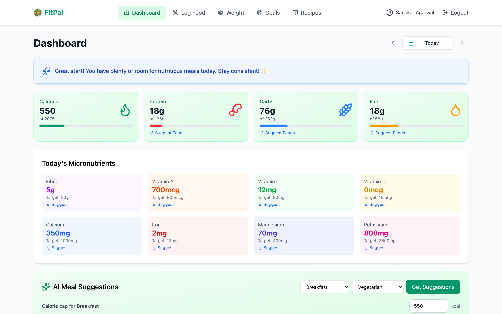

# FitPal 🥗

**AI-powered nutrition tracker built for Indian cuisine — private by design.**

FitPal is a Progressive Web App (PWA) that helps you log Indian meals in plain language, track weight and goals, and get AI-driven nutrition insights. It runs as a React single-page app with a lightweight local Express server for storage, so your data stays on your own machine.



> More screens (Login, Log Food, Weight, Goals, Recipes, Profile) are in the [docs/images/](docs/images/) folder.

---

## ✨ Highlights

- 🤖 **Agentic meal logging** — describe meals in natural language ("2 rotis and a katori of dal for lunch at 1pm"), and the AI logs, updates, or deletes entries for you.
- 🍛 **AI food analysis** — accurate macro + micronutrient estimates for Indian dishes, with a confidence indicator and editable calories when an estimate looks off.
- 📊 **Smart dashboard** — animated stat cards, macro pie chart, and weekly trend lines powered by Recharts.
- ⚖️ **Weight tracking** — BMI, body-fat, goal progress, and a streak system to reward consistency.
- 🎯 **Goal setting** — auto-calculated calorie/macro targets from your profile (Mifflin–St Jeor), fully customizable.
- 👨‍🍳 **Recipe suggestions** — healthy Indian recipes tailored to your diet preference and goals.
- 💡 **Nutrient suggestions** — one-click AI food ideas to close the gap on any remaining nutrient.
- 📱 **Installable PWA** — works offline, responsive across phone/tablet/desktop.
- 🔒 **Privacy first** — local SQLite storage, no third-party cloud beyond the AI provider you choose.

See **[FEATURES.md](docs/FEATURES.md)** for the full feature breakdown.

---

## 🚧 In Progress

Some features are actively being worked on — see **[TODO.md](docs/TODO.md)** for details.

---

## 🤖 AI Providers

FitPal talks to AI models through the [Vercel AI SDK](https://sdk.vercel.ai), so it works with **any OpenAI-compatible Chat Completions API** — you just set `AI_API_KEY`, `AI_BASE_URL`, and `AI_MODEL`. The key is read **server-side only** and never shipped to the browser.

All AI features rely on **structured outputs**: every request asks the model for JSON matching a `zod` schema, which the SDK enforces (via native JSON-schema, JSON mode, or tool calling, whichever the model supports) and validates before use. This keeps food analysis, meal logging, and suggestions reliable instead of parsing free-form text. Models with stronger structured-output support generally give better results.

### Supported

- [x] **OpenAI** (`gpt-4o`, `gpt-4o-mini`, …)
- [x] **Azure OpenAI** — set `AI_PROVIDER=azure` (uses the dedicated Azure SDK)
- [x] **OpenAI-compatible gateways** — [LiteLLM](https://github.com/BerriAI/litellm), [OpenRouter](https://openrouter.ai/) (reach Anthropic, Google, etc. through them)
- [x] **Local / self-hosted** — [Ollama](https://ollama.com/), vLLM, and other OpenAI-compatible servers

### Planned

- [ ] **Native Anthropic** provider (`@ai-sdk/anthropic`) — target the Claude API directly, no gateway
- [ ] **Native Google** provider (`@ai-sdk/google`) — target the Gemini API directly, no gateway

See **[TODO.md](docs/TODO.md)** for the roadmap.

---

## 🚀 Quick Start

### Prerequisites
- An **AI provider** with an OpenAI-compatible Chat Completions API — required for AI features. This can be OpenAI, a [LiteLLM](https://github.com/BerriAI/litellm) proxy, OpenRouter, a local [Ollama](https://ollama.com/) or vLLM server, Azure OpenAI, etc.
- **Docker** (for the recommended self-host path) **or Node.js 24+** (to run from source).

The AI key is read **server-side only** — it is never shipped to the browser.

---

## 🐳 Self-Hosting with Docker (recommended)

The whole app (frontend + API) runs as a single container. Your data is stored
as JSON on a mounted volume, so it survives upgrades.

```bash
# 1. Grab the compose file and the env template
curl -O https://raw.githubusercontent.com/sanskagarwal/FitPal/main/docker-compose.yml
curl -o .env https://raw.githubusercontent.com/sanskagarwal/FitPal/main/.env.example

# 2. Edit .env with your AI provider details:
#      AI_API_KEY=your-key-here
#      AI_BASE_URL=https://api.openai.com/v1
#      AI_MODEL=gpt-4o-mini

# 3. Start it
docker compose up -d
```

Open <http://localhost:3001>. Update later with `docker compose pull && docker compose up -d`.

> The image is published as `ghcr.io/sanskagarwal/fitpal`. To build locally
> instead, comment out `image:` in
> `docker-compose.yml`, uncomment `build: .`, and run `docker compose up -d --build`.

### Run the container directly (without compose)

```bash
docker run -d --name fitpal -p 3001:3001 \
  -e AI_API_KEY=your-key-here \
  -e AI_BASE_URL=https://api.openai.com/v1 \
  -e AI_MODEL=gpt-4o-mini \
  -v fitpal-data:/app/data \
  ghcr.io/sanskagarwal/fitpal:latest
```

---

## 🧑‍💻 Run from source (development)

### 1. Install

```bash
git clone <repository-url>
cd FitPal
npm install
cd server && npm install && cd ..
```

### 2. Configure

```bash
cp .env.example .env
```

Edit `.env` with your AI provider details:

```env
AI_API_KEY=your-key-here
AI_BASE_URL=https://api.openai.com/v1
AI_MODEL=gpt-4o-mini
```

> Works with any OpenAI-compatible API. To use **Azure OpenAI**, set `AI_PROVIDER=azure` (with `AI_BASE_URL` as the resource endpoint, `AI_MODEL` as the deployment name, and `AI_API_VERSION`). See [.env.example](.env.example) for all options.

### 3. Run

```bash
npm run dev:all
```

- Frontend → http://localhost:5173 (proxies `/api` to the server)
- Storage + AI server → http://localhost:3001

Or run them in separate terminals:

```bash
npm run dev      # frontend
npm run server   # storage + AI server
```

### Production build from source

```bash
npm run build                 # build the frontend
cd server && npm run build    # build the server
node dist/index.js            # serves API + the built frontend on one port
```

---

## 🧭 Usage

1. **Register** with your basics (DOB, height, activity level) — FitPal estimates your starting goals.
2. **Set goals** — tweak target weight, calories, and macros, or let AI suggest them.
3. **Log meals** — use the natural-language quick-log, or search foods and add them manually.
4. **Track weight** — log regularly to build a streak and watch goal progress.
5. **Review the dashboard** — daily totals, macro split, and weekly trends.
6. **Discover recipes** and **nutrient suggestions** to hit your targets.

---

## 🛠️ Tech Stack

**Frontend**
- React 19 + TypeScript
- Vite 8 (build/dev)
- Tailwind CSS v4
- Recharts (charts) · Motion / Framer Motion (animations) · Lucide (icons) · react-markdown
- vite-plugin-pwa (offline + installable)

**Server**
- Express 5 + TypeScript (tsx for dev)
- SQLite storage (`better-sqlite3`) at `server/data/fitpal.db`
- Serves the built frontend and proxies all AI calls (single process in production)

**AI**
- Any OpenAI-compatible Chat Completions API via the **Vercel AI SDK** (`ai` + `@ai-sdk/openai-compatible`, plus `@ai-sdk/azure` for Azure), with structured outputs validated by `zod`, called **server-side** so the key stays private

---

## 📁 Project Structure

```
FitPal/
├── src/                  # Frontend SPA
│   ├── components/       # UI (Dashboard, FoodLogger, WeightTracker, …)
│   ├── context/          # AuthContext
│   ├── services/         # openai.ts (calls the backend /api/ai routes)
│   ├── utils/            # db.ts (API client), helpers, export/import
│   └── types/            # Shared TypeScript types
├── server/               # Express storage + AI server
│   ├── index.ts          # REST API + static frontend hosting
│   ├── ai.ts             # AI integration via the Vercel AI SDK (server-side)
│   └── data/             # SQLite database (fitpal.db)
├── public/               # PWA icons & static assets
├── Dockerfile            # Multi-stage build (single-process image)
├── docker-compose.yml    # Self-host deployment
├── vite.config.ts        # Vite + PWA config
└── package.json
```

---

## 📦 Scripts

| Command | Description |
| --- | --- |
| `npm run dev` | Start the Vite dev server |
| `npm run server` | Start the local storage server |
| `npm run dev:all` | Run frontend + server together |
| `npm run build` | Type-check and build for production |
| `npm run preview` | Preview the production build |
| `npm run lint` | Run ESLint |

---

## 🔗 More Docs

- **[FEATURES.md](docs/FEATURES.md)** — complete feature list
- **[DEVELOPER.md](docs/DEVELOPER.md)** — architecture, API reference, data models, and contribution guide

## 📄 License

See [LICENSE](LICENSE).

---

**FitPal** — track Indian meals smartly & privately 🥗💪
