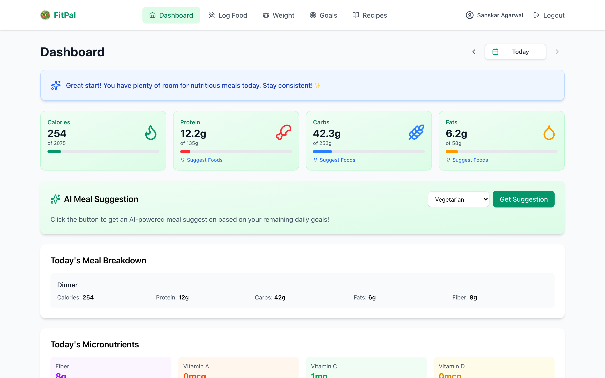

# FitPal 🥗

**AI-powered nutrition tracker built for Indian cuisine — private by design.**

FitPal is a Progressive Web App (PWA) that helps you log Indian meals in plain language, track weight and goals, and get AI-driven nutrition insights. It runs as a React single-page app with a lightweight local Express server for storage, so your data stays on your own machine.



> More screens (Login, Log Food, Weight, Goals, Recipes, Profile) are in the [docs/](docs/) folder.

---

## ✨ Highlights

- 🤖 **Agentic meal logging** — describe meals in natural language ("2 rotis and a katori of dal for lunch at 1pm"), and the AI logs, updates, or deletes entries for you.
- 🍛 **AI food analysis** — accurate macro + micronutrient estimates for Indian dishes, with a confidence indicator and editable calories when an estimate looks off.
- 📊 **Smart dashboard** — animated stat cards, macro pie chart, and weekly trend lines powered by Recharts.
- ⚖️ **Weight tracking** — BMI, body-fat, goal progress, and a streak system to reward consistency.
- 🎯 **Goal setting** — auto-calculated calorie/macro targets from your profile (Mifflin–St Jeor), fully customizable.
- 👨‍🍳 **Recipe suggestions** — healthy Indian recipes tailored to your diet preference and goals.
- 💡 **Nutrient suggestions** — one-click AI food ideas to close the gap on any remaining nutrient.
- 📱 **Installable PWA** — works offline, responsive across phone/tablet/desktop.
- 🔒 **Privacy first** — file-based local storage, no third-party cloud beyond your own Azure OpenAI resource.

See **[FEATURES.md](FEATURES.md)** for the full feature breakdown.

---

## 🚀 Quick Start

### Prerequisites
- **Node.js 24+**
- An **Azure OpenAI** resource with a GPT-4o (or compatible) deployment — required for AI features.

### 1. Install

```bash
git clone <repository-url>
cd FitPal
npm install
cd server && npm install && cd ..
```

### 2. Configure

```bash
cp .env.example .env
```

Edit `.env` with your Azure OpenAI details:

```env
VITE_AZURE_OPENAI_ENDPOINT=https://your-resource-name.openai.azure.com
VITE_AZURE_OPENAI_KEY=your_api_key_here
VITE_AZURE_OPENAI_DEPLOYMENT=gpt-4o
VITE_API_URL=http://localhost:3001/api
```

> ⚠️ The AI calls run **client-side**, so the key is shipped to the browser in a dev build. Use a scoped/proxied key for any real deployment — never a production secret.

### 3. Run

```bash
npm run dev:all
```

- Frontend → http://localhost:5173
- Storage server → http://localhost:3001

Or run them in separate terminals:

```bash
npm run dev      # frontend
npm run server   # storage server
```

---

## 🧭 Usage

1. **Register** with your basics (DOB, height, activity level) — FitPal estimates your starting goals.
2. **Set goals** — tweak target weight, calories, and macros, or let AI suggest them.
3. **Log meals** — use the natural-language quick-log, or search foods and add them manually.
4. **Track weight** — log regularly to build a streak and watch goal progress.
5. **Review the dashboard** — daily totals, macro split, and weekly trends.
6. **Discover recipes** and **nutrient suggestions** to hit your targets.

---

## 🛠️ Tech Stack

**Frontend**
- React 19 + TypeScript
- Vite 8 (build/dev)
- Tailwind CSS v4
- Recharts (charts) · Motion / Framer Motion (animations) · Lucide (icons) · react-markdown
- vite-plugin-pwa (offline + installable)

**Storage server**
- Express 5 + TypeScript (tsx for dev)
- File-based JSON storage under `server/data/`

**AI**
- Azure OpenAI (GPT-4o) via the `openai` SDK with structured outputs (`zod`)

---

## 📁 Project Structure

```
FitPal/
├── src/                  # Frontend SPA
│   ├── components/       # UI (Dashboard, FoodLogger, WeightTracker, …)
│   ├── context/          # AuthContext
│   ├── services/         # openai.ts (Azure OpenAI integration)
│   ├── utils/            # db.ts (API client), helpers, export/import
│   └── types/            # Shared TypeScript types
├── server/               # Local Express storage server
│   ├── index.ts          # REST API
│   └── data/             # JSON files (per user)
├── public/               # PWA icons & static assets
├── vite.config.ts        # Vite + PWA config
└── package.json
```

---

## 📦 Scripts

| Command | Description |
| --- | --- |
| `npm run dev` | Start the Vite dev server |
| `npm run server` | Start the local storage server |
| `npm run dev:all` | Run frontend + server together |
| `npm run build` | Type-check and build for production |
| `npm run preview` | Preview the production build |
| `npm run lint` | Run ESLint |

---

## 🔗 More Docs

- **[FEATURES.md](FEATURES.md)** — complete feature list
- **[DEVELOPER.md](DEVELOPER.md)** — architecture, API reference, data models, and contribution guide

## 📄 License

See [LICENSE](LICENSE).

---

**FitPal** — track Indian meals smartly & privately 🥗💪
